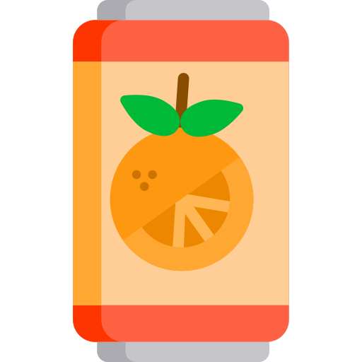

# fanta-tiktok
Fanta and Tiktok Flavour Challenge

[![LinkedIn][linkedin-shield]][linkedin-url]

<h2>Client</h2>

Contract: Subvrsive

<b>for Coca Cola Company</b>

<!-- PROJECT LOGO -->
 

 

  

<h3 align="center">Fanta and Tiktok Flavour Challenge</h3>

  

Augmented reality web based experience for a Fanta and Tiktok campaign, promoting new Fanta flavours.
  

 

<!-- ABOUT THE PROJECT -->
## About The Project

 

 
 This webAR experience, built with 8th Wall, A-FRAME and REACT, challenges influencer to test Fanta flavours in relation with the watched content.

 
  <h3>Challenges</h3
   

Creating different and fun kinds of animations for the cards and making sure the UI was friendly towards the target user.
   

https://github.com/victorcappa/fanta-tiktok/assets/40408965/16efee91-7d3a-45a4-93fd-3c2fb2f179a1

(<a href="#top">back to top</a>)

<!-- LICENSE -->
## License

All intellectual property is owned by Coca Cola Company

(<a href="#top">back to top</a>)

<!-- CONTACT -->
## Contact

Reach out - <a href = "mailto: victorcappa@imaginar.dev">Victor Cappa @imaginar</a>
 
<a href="https://www.linkedin.com/in/victor-cappa-50839788/">Linkedin</a>

(<a href="#top">back to top</a>)

[linkedin-shield]: https://img.shields.io/badge/-LinkedIn-black.svg?style=for-the-badge&logo=linkedin&colorB=555
[linkedin-url]: https://www.linkedin.com/in/victor-cappa-50839788/

